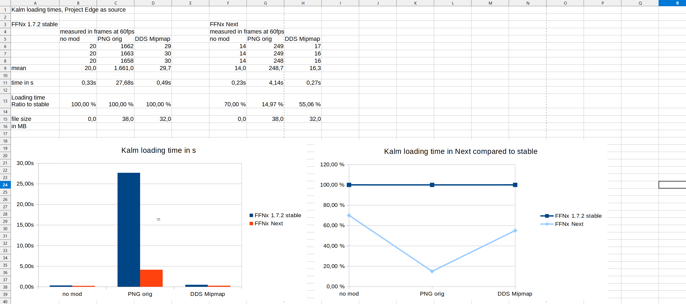

# 1.8.0

Full commit list since last stable release: https://github.com/julianxhokaxhiu/FFNx/compare/1.7.2...1.8.0

### New Logo

Every project deserves a kick-ass logo, and we finally managed to have one created for FFNx. This was done thanks to a silent contributor to the project who worked tirelessly night and day, draft after draft, to bring to you this: the true spirit of FFNx in one image. Enjoy!

  
   <strong><small>Kudos to <a href="https://www.instagram.com/aryaaiedail/">Cinzia Cancedda (aryaaiedail)</a></small></strong>

### Rock-Stable Rendering Engine

In this release, the rendering engine has been completely polished, cleaned up, and improved to ensure every GPU clock is squeezed to the max to give you the best performance ever, even under pressure. Because of this, **Vulkan** and **DirectX 12** are stable and fully functional, able to push as many FPS as your GPU can generate.

Additionally, you can now toggle full-screen on the fly (Alt+Enter), or resize/maximize the window on demand. The initial configuration is just there to ensure the game starts as you expect it to.

Enjoy a new butter-smooth experience under AMD, NVIDIA, and even Intel GPUs.

### New Audio Engine

This release brings with it also a completely new Audio Engine powered by [SoLoud](https://sol.gfxile.net/soloud/). This allows FFNx to reach levels never before seen on FF7 and FF8.

#### Sound Effects Replacement

It is now possible to replace in-game sound effects, and configure new behaviors on top of them. For example, you can shuffle a given sound effect each time the engine calls for it. Your Omnislash limit break has never felt so real.

To learn more about this feature, please see [Audio Configuration](./How-To_Audio%20Configuration)

#### Music Enhancement

The music layer has also been completely reworked to bring you the best audio experience yet. Not only are commonly used containers like ogg and mp3 supported, but FFNx now supports surround playback (up to 7.1), along with native PSX (and PS2) sound files! This is made possible through [OpenPSF](https://github.com/myst6re/openpsf) by [myst6re](http://forums.qhimm.com/index.php?action=profile;u=4778) who is also a direct contributor to FFNx. We all need to thank him, as he is working tirelessly in improving the audio engine in general.

Not only that, myst6re’s work allows you to finally hear the full OST from start to end, as he has implemented proper resuming on the world map and field modules of both FF7 and FF8. Music resumes where you left off, even between screen changes!

Not being happy with just these great features, myst6re also managed to implement a full music replacement for FF8, improving the quality over the entire game, including the **Horizon Concert**. For now, his own custom pack [FFNx FF8Music](http://forums.qhimm.com/index.php?topic=19968.0) is the first to make use of this layer, and more will come in the future.

Finally, this layer is fully configurable, allowing users to do things like shuffling music for a given field and much more. To learn more about this feature, please see [Audio Configuration](./How-To_Audio%20Configuration)

#### Voice acting

We're not done yet! The new audio engine allows us also to bring one of the most anticipated features of all classical FF fans, dubbing every single line in game! Yes, you **heard** that right!

One of the first mods to make use of this will be [Echo-S](https://forum.tsunamods.com/viewtopic.php?f=65&t=9). But please, remember to not ask for an ETA :)

Finally you can configure some of the voice acting behavior layer in your [`FFNx.toml` config file](https://github.com/julianxhokaxhiu/FFNx/blob/master/misc/FFNx.toml#L155)

### XInput Gamepad support

You can now play on FF7 and FF8 using all of your gamepad buttons, including the dpad. It's time to enjoy the PSX experience on PC, finally!

### New configuration file

This release comes with a new configuration file syntax which closely resembles the old, but enables us to accomplish many more cool things in code. The configuration syntax is named TOML.

Feel free to check out [Learn TOML in Y minutes](https://learnxinyminutes.com/docs/toml/) for a quick tutorial.

### Fancy Transparency Yes or No? Why not both

Working closely with [Satsuki](http://forums.qhimm.com/index.php?action=profile;u=24647) and [Chrysalis](http://forums.qhimm.com/index.php?action=profile;u=674) brought up new testing scenarios I was not aware of.

Thanks to their tireless efforts in checking every single bit of code written in Nx, on top of their astonishing mods, we found that it was possible to actually drop the `fancy_transparency` option and let the driver code decide whether to use it.

Consequently, the driver now has full knowledge of how to blend the current texture by detecting whether it's custom or default, and based on that, correctly blend it on screen to create the best visual output. Goodbye visual glitches!

### Improved memory management

Compared to previous releases, v1.8.0 is MUCH faster in loading textures in memory while running the game, and at the same time, less demanding on that memory.

---

  
   <strong><small>Kudos to <a href="http://forums.qhimm.com/index.php?action=profile;u=1016">Rumbah</a></small></strong>

---

It is now possible to use the **full 32-bit, 4GB memory space** for your mods ( remember to patch your game exe with [4GB Patch](https://ntcore.com/?page_id=371) in order to make use of this ).

### Gameplay enhancements

This release also brings a TON of gameplay enhancements which, even though they’re not really part of FFNx’s core mission, add a lot of fun. For instance, you can speedhack the engine to grind faster, skip movies completely, toggle random encounters, and even soft reset if you did something wrong and prefer to restart your progress where you left off. Just like the good old times on your Playstation 1 :)

To learn more about this feature, please see [Shortcuts](./Shortcuts)

### DevTools

Wait, what? Did I read that correctly?...Yes, you did!

This release brings a completely new set of development tools you can use with FF7 and FF8 to accomplish tasks which previously had to be done through third-party tools like Cheat Engine, such as jumping between FF7 fields with a couple of clicks, or exploring FF8’s world geometry.

This is just the beginning! The layer has been designed to be opened further via external APIs and additional modules that you can code and FFNx will then load. Stay tuned for more information in future releases.

To learn more about this feature, please see [DevTools](./How-To_DevTools)

### FF7: Animated Textures (EXPERIMENTAL!)

There's also a new, proof-of-concept implementation available to allow modders to replace in-game animated texture layers, like the light effect or water cascade behind Aerith’s house. Be aware that because of how they are implemented, it is not possible to predict their state, and in order to allow them to be replaced we have to hash their pixel content on every draw call.

This brings old hardware to its knees, so the functionality is OFF by default, but you can easily enable it in the [`FFNx.toml` config file](https://github.com/julianxhokaxhiu/FFNx/blob/master/misc/FFNx.toml#L247).

### FF8: Background mode

By default, FF8 pauses the game if the window loses focus. No more! Starting this release, FF8 will continue running while window focus is on something else.

### Tons of game bugs fixed!

If you ever played the game on PC, even the official Steam release has some weird graphical bugs here and there which might annoy you. This release tries to squash many of them, making for a pixel perfect game (mostly) everywhere.

In order to enjoy this, make sure to follow the [Installation Instructions](https://github.com/julianxhokaxhiu/FFNx#how-to-install) for the edition you're willing to play. It is **very important** to follow each step.

Additionally, a lot of sound, music, and miscellaneous other bugs were fixed in both FF7 and FF8.

## Special thanks to

This release would have never been possible if this list of contributors would not have participated:
https://github.com/julianxhokaxhiu/FFNx/graphs/contributors

In addition to that list, special thanks must also be given to:

- [Bers](http://forums.qhimm.com/index.php?action=profile;u=27643) (https://github.com/berserkingyadis)
- [Chrysalis](http://forums.qhimm.com/index.php?action=profile;u=674)
- [L@Zar0](http://forums.qhimm.com/index.php?action=profile;u=40773)
- [OatBran](http://forums.qhimm.com/index.php?action=profile;u=27603)
- [Rumbah](http://forums.qhimm.com/index.php?action=profile;u=1016)
- [Satsuki](http://forums.qhimm.com/index.php?action=profile;u=24647)

Their testing efforts is what allowed FFNx to mark another stable release. Thank you from the bottom of my heart!

Additionally, some more special thanks goes to:

- [Aali](http://forums.qhimm.com/index.php?action=profile;u=2862)
- [quantumpencil](http://forums.qhimm.com/index.php?action=profile;u=23810)

Their help behind the scenes was extremely helpful to accomplish some of this release goals. Thank you again as well from the bottom of my heart!

One more special thanks goes also to:

- [LordUrQuan](http://forums.qhimm.com/index.php?action=profile;u=28301)

For reviewing this changelog release and squashing (almost) all the bugs out of it. Thank you as well from the bottom of my heart!

---

If you appreciate what is being done, and what has been done so far, feel free to donate through the [Sponsoring](https://github.com/sponsors/julianxhokaxhiu) program here on Github.

---

**PLEASE NOTE:**

1. This release brings a **whole new** configuration file type that is **NOT** compatible with previous releases. Please make sure you install all the provided files before starting with the new FFNx.
2. It is HIGHLY SUGGESTED to always use the default config file. Using old config files will probably end up with unexpected behaviors.
